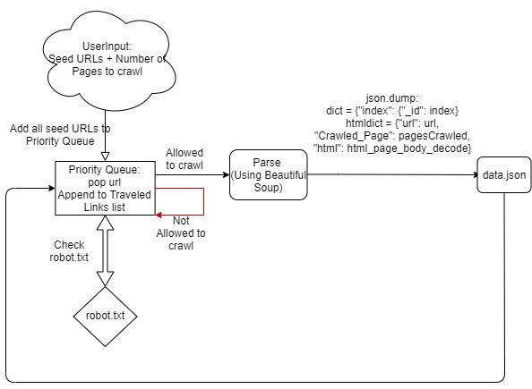
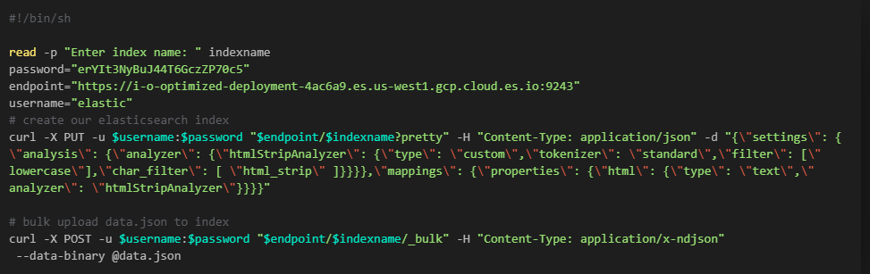
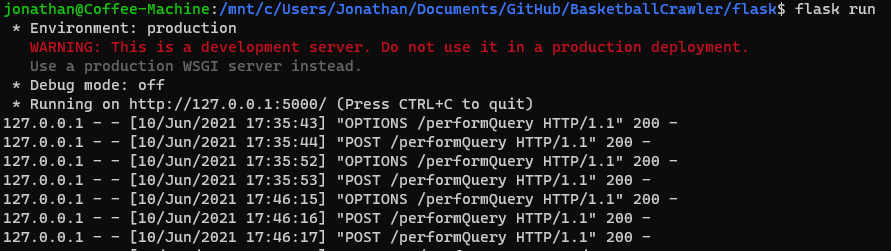
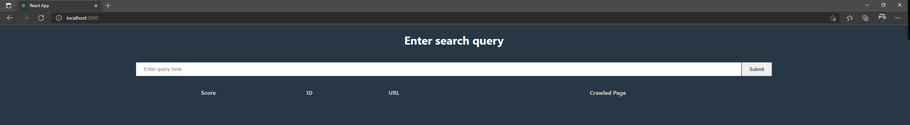
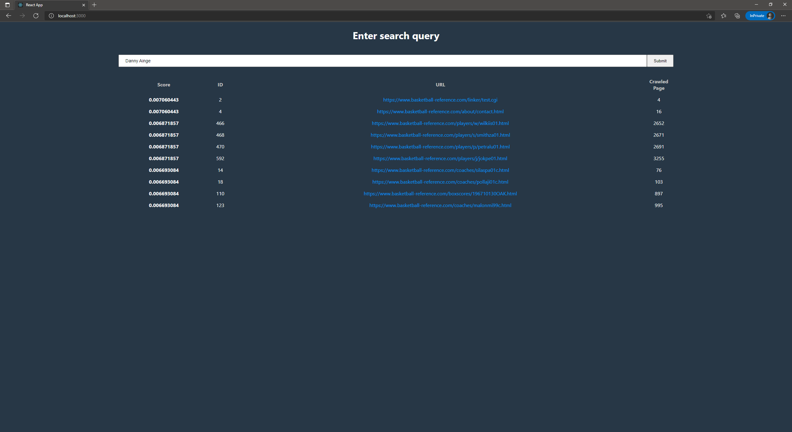

# CS172 Final Project
## Collaboration Details: 
### Marc Jimenez: Crawler
### Trevor Gorman: Indexer
### Jonathan Picazo: Extension

## Part 1 - Crawler
### Overview of system, including (but not limited to)
#### (a) Architecture

#### (b) The Crawling or data collection strategy (do you handle duplicate URLs, is your crawler parallel, etc.)
Our crawler makes use of two lists one called ***PriorityQueue[]*** and another called ***TraveledLinks[]***. Every
URL popped from our **PriorityQueue** will be added to our **TraveledLinks** list and after parsing through the URL's 
HTML, we will iterate through all existing links and check to see if they exist in both of our **PriorityQueue** and **TraveledLinks** lists. If they do not then we will add it to our **PriorityQueue**.
#### (c) Data Structures employed
We make use of the Python Data Structure List
### (d) Limitations (if any) of the system.
UNSURE
### (e) Instruction on how to deploy the crawler. 
To run the crawler run the following command:
```
python3 crawler.py <seedURLs.txt> <number of pages to crawl> <data.json>
```
## Part 2 - Indexer
The indexer is ran by running the command:
```
./indexer.sh
```
When the script is ran, it asks for the name of the desired index.
The output of the script is the output from elasticsearch when creating and bulk loading an index.
You can redirect the std output by appending > output.txt when running the script.
The script creates an index, given a name, and bulk loads the crawled data.json into the given index using curl commands.
Here is a screenshot of the contents of our indexer bash script.

Although this part and script is relatively short, it took the longest to implement because we had to format our data.json correctly for bulk upload and research elasticsearch requests.
## Part 3 - Extension
#### For our extension, we decided to choose the Web application. Our web application is built from React, and is a search bar that returns the top 10 scores in descending order for a given query. We chose this option because some of us were already familiar with building web applications.
### Backend (Flask)
#### To perform elasticsearch search queries, we decided to use Flask as our backend to run the queries using Elasticsearch's python library. The backend script in ```flask/app.py```, and calls the Elasticsearch library to return the search query results. The search does not have to be a single term, but multiple terms. We used the "match_phrase" parameter when searching the index to allow for queries of multiple words. We added a sort parameter to elasticsearch's search function to sort the scores by top 10 in descending order.
```
esConn.search(index=indexName, body={"query": {"match_phrase": {"html": searchtarg}}}, sort={'_score: {"order": "desc, "mode": "max"'}) 
```
#### Our backend also parses the json output and returns the top 10 scores with their corresponding url, id, and crawled page number.
#### To run the flask backend, flask and flask-cors must be installed in pip. After installing both libaries, go to the flask folder and run the backend by typing: ```flask run```
#### More details on flask installation here: 
#### https://flask-cors.readthedocs.io/en/latest/
#### Here is a screenshot of our backend terminal showing it handling POST requests from the frontend.

#### 
### Frontend (React)
#### Our node application is stored in ```baskindex/```. To run the app, you must move into the directory and run ```npm install``` to download the node modules and run ```npm start``` to run the web application. More information for npm is listed in a readme in the baskindex folder. The frontend is responsible for getting the query input from the user and sending a POST request (using axios) to receive the elastic search data. Originally, we were going to communicate with elasticsearch using axios, but there were issues with accessing CORS. Because of this, we decided to create a backend solely responsible for handling elasticsearch search operations. After entering a query, the web application returns the top 10 scores in a table format. The table's headers are score, id, url, and crawled page. The crawled page variable refers to the number that the page was crawled, whether the crawl was successful or unsuccessful. The urls displayed are clickable and will turn red if hovered over, purple if visited, and blue if not-visited (like default hyperlink colors). If clicked, the url will be displayed on a new tab so the user can keep viewing the table even after clicking on a link. Our web application is essentially a search bar for the crawled webpages (which is from basketball-reference.com)
#### Here is how our application looks by default.

#### This is our web application after query "Danny Ainge" is entered.

